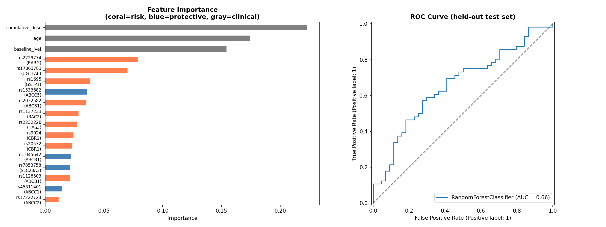
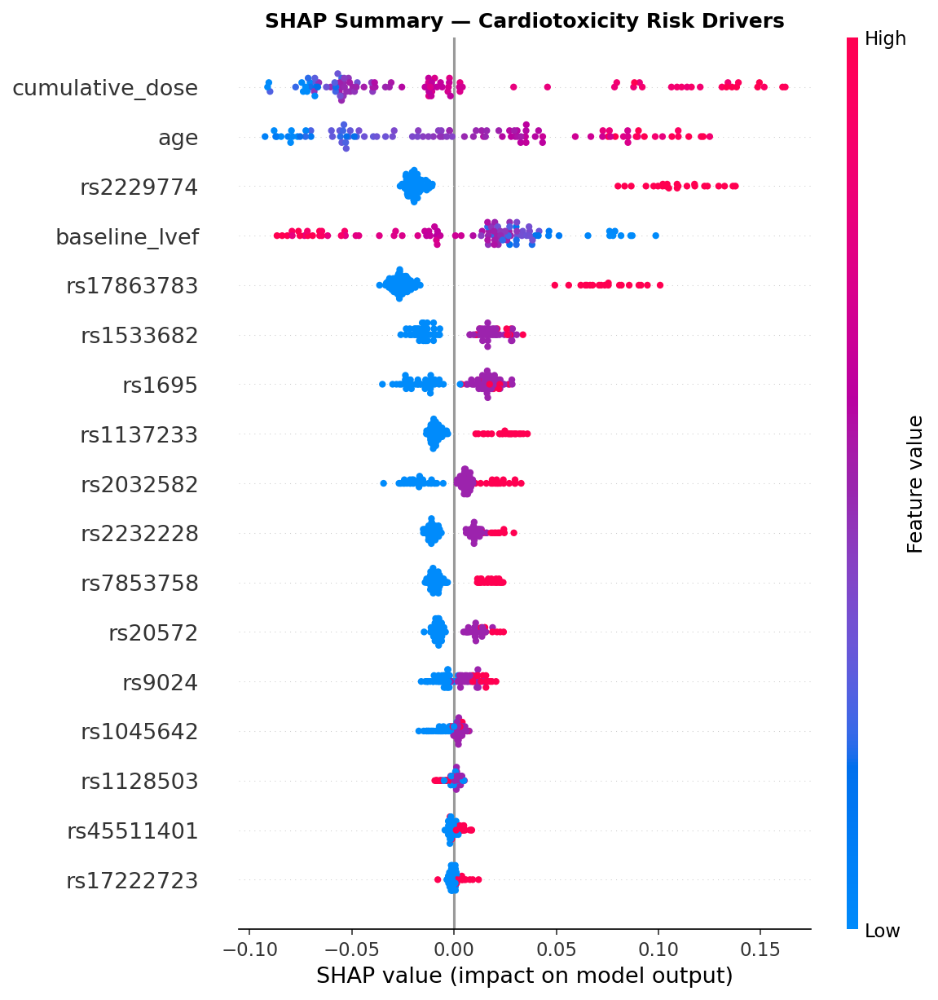

# Predicting Doxorubicin-Induced Cardiotoxicity from Germline Variants

Roughly 10–15% of patients on doxorubicin develop irreversible cardiomyopathy, but dosing decisions ignore genetic predisposition completely — everyone gets treated by cumulative threshold alone. After going through the Aminkeng 2015 and Blanco 2012 GWAS papers, I wanted to see if I could reconstruct a variant-based risk score from published associations and check whether the model recovers the same top hits the original studies found.

## Data Sources
- **PharmGKB** Clinical Variants + Variant Annotations (clinicalVariants.tsv, 
  var_drug_ann.tsv) - curated variant-drug-phenotype associations
- **Primary GWAS literature** - Aminkeng et al. 2015 (Nat Genet), Blanco et al. 
  2012 (Nat Genet), Wojnowski et al. 2005
- **Synthetic patient cohort** (N=500) - genotypes simulated using real minor 
  allele frequencies from gnomAD; outcomes generated from published odds ratios. 
  Clearly labelled as synthetic pending dbGaP phs000673 approval for real data.

## Variant Panel (14 variants, 9 genes)

| rsID | Gene | Evidence | Role |
|------|------|----------|------|
| rs2229774 | RARG | GWAS hit (Aminkeng 2015) | Retinoic acid receptor - top cardiotoxicity locus |
| rs7853758 | SLC28A3 | 2B (PharmGKB) | Nucleoside transporter - protective allele |
| rs17863783 | UGT1A6 | GWAS hit (Blanco 2012) | Drug glucuronidation |
| rs1137233 | RAC2 | Candidate | Oxidative stress pathway |
| rs9024 | CBR1 | Level 3 | Doxorubicin carbonyl reduction |
| rs2232228 | HAS3 | Level 3 | Hyaluronan synthesis |
| rs17222723 | ABCC2 | Level 3 | Efflux transporter |
| rs45511401 | ABCC1 | Level 3 | Efflux transporter |
| rs1695 | GSTP1 | Level 3 | Oxidative stress / detoxification |
| rs20572 | CBR1 | PK | Metabolism |
| rs1533682 | ABCC5 | PK | Transport |
| rs1128503 | ABCB1 | PK | Efflux |
| rs2032582 | ABCB1 | PK | Efflux |
| rs1045642 | ABCB1 | PK | Efflux |

## Results

- **5-fold CV ROC-AUC: 0.66 ± 0.05** (Random Forest, class-balanced)
- **Top genetic features: RARG > UGT1A6 > GSTP1** - the model recovers known 
  GWAS hits are the most predictive variants, confirming biological plausibility
- SHAP analysis confirms direction of effect: RARG risk allele pushes prediction 
  toward cardiotoxicity (consistent with Aminkeng 2015); SLC28A3 protective An 
  allele reduces risk (consistent with Blanco 2012)




## Key Finding
The model independently recovers RARG (rs2229774) as the top genetic predictor - 
the same variant identified as the primary cardiotoxicity locus in the landmark 
Aminkeng 2015 Nature Genetics GWAS. This validates the feature pipeline without 
access to real patient data.

## Connection to Project 1
Patients with high ABCB1 expression (top resistance gene in Project 1) efflux 
doxorubicin faster → less drug accumulates in cardiac tissue → potentially lower 
cardiotoxicity risk, but also lower tumour kill efficacy. That tradeoff - more efflux means less cardiac damage but also less tumour kill - is something I want to look at properly once I have real patient data.

## Limitations
- Synthetic cohort - outcomes generated from published ORs, not real patient data
- European MAF used for simulation - real predictions require ancestry-matched 
  frequencies
- Model trained without epistasis terms - gene-gene interactions not captured
- dbGaP access request submitted (phs000673) for real validation cohort
- 0.66 AUC on synthetic data is a proof-of-concept, not a clinical claim

## Planned Extensions
- Validate on real dbGaP phs000673 cohort when access approved
- Add polygenic risk score (PRS) as clinical comparison baseline
- Incorporate ancestry as covariate using 1000 Genomes population labels
- Extend to other cardiotoxic drugs (epirubicin, cyclophosphamide)

## Repo Structure
```
data/
  cardiotoxicity_master_variants.csv
  synthetic_patients_v2.csv
notebooks/
  02_classifier.ipynb
src/
  classifier.py
results/
  results_classifier_v2.png
  shap_summary_v2.png
```
